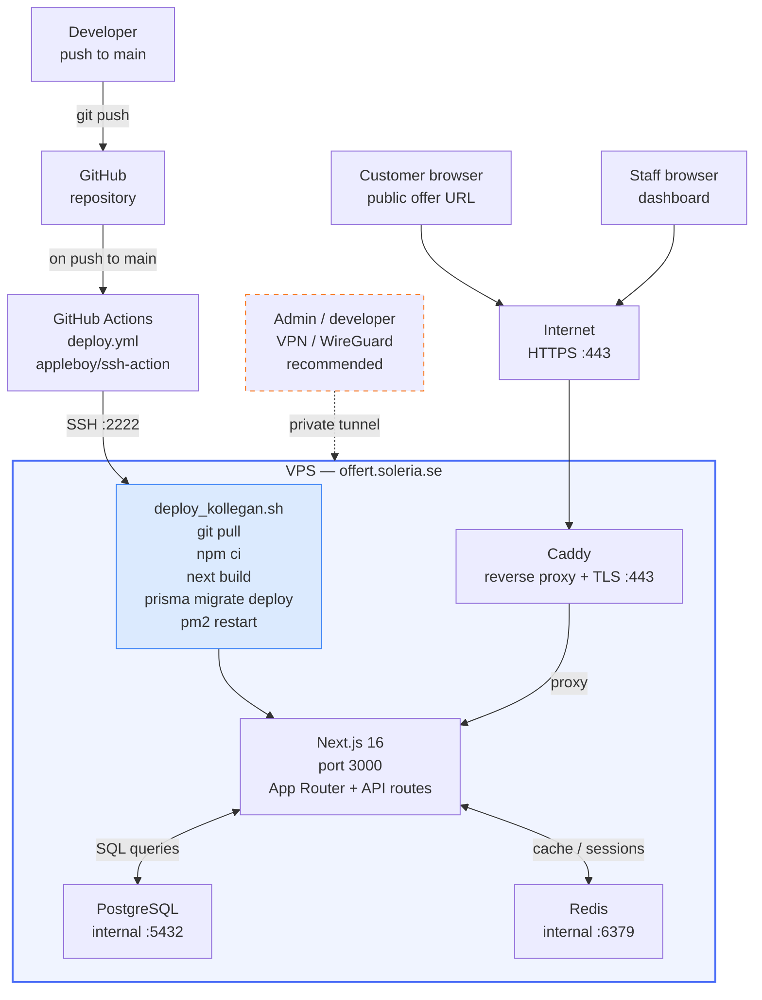

# Leveransberättelse — Vad som saknas och behöver åtgärdas

Genomgång av rapporten mot faktisk kod, schema och deploy-konfiguration.
Dokumentet är indelat i tre delar: (1) saknade filer, (2) korrigeringar/tillägg till texten, (3) Mermaid-kod för diagram.

---

## Del 1 — Saknade bilage-filer

Alla filer nedan refereras i rapporten men existerar inte ännu.

### Skärmdumpar (måste tas manuellt från appen)

| Fil | Vad som ska visas | Hur |
|---|---|---|
| `bilagor/skarmdumpar/bilaga-a-skapa-offert.png` | Vyn `/offerter/ny` — välj mall, fyll i mottagare, lägg till produktrader | Logga in på offert.soleria.se → Ny offert |
| `bilagor/skarmdumpar/bilaga-b-lista-offerter.png` | Vyn `/offerter` — statusflikar (Alla / Skickade / Accepterade etc.), offertlistan med datum, belopp, mottagare | Logga in → Offerter |
| `bilagor/skarmdumpar/bilaga-c-kundvy.png` | Den publika vyn `/offerter/publik/[token]` — offertinnehåll, summering, signaturknapp | Skicka en testoffert, öppna länken som kund |

**Tips:** Använd webbläsarens fullside-screenshot (Firefox: högerklick → Ta skärmbild av sida, eller Chrome-tillägget "Full Page Screen Capture") för att fånga hela sidan.

---

### Diagram (genereras från mermaid.ai — exportera PNG + SVG)

| Fil | Mermaid-länk | Beskrivning |
|---|---|---|
| `bilagor/diagram/bilaga-d-er-diagram-offertsystem.png` | https://l.mermaid.ai/hgvpEN | ER-diagram Offer Domain |
| `bilagor/diagram/bilaga-d-er-diagram-offertsystem.svg` | https://l.mermaid.ai/hgvpEN | (samma länk, välj SVG vid export) |
| `bilagor/diagram/bilaga-e-driftoversikt-vps-vpn-github-actions.png` | https://l.mermaid.ai/4ApPdA | Driftöversikt VPS + CI/CD |
| `bilagor/diagram/bilaga-e-driftoversikt-vps-vpn-github-actions.svg` | https://l.mermaid.ai/4ApPdA | (samma länk, välj SVG vid export) |

**Export:** Öppna länken → klicka Actions (övre höger) → Download PNG / Download SVG.

**Övriga ER-diagram (om fler bilagor önskas):**
- Identity & Auth: https://l.mermaid.ai/Zv0ATV
- Full Platform Overview (classDiagram): https://l.mermaid.ai/6UJFUM
- Supporting Domains: https://l.mermaid.ai/Ri9VQE

---

## Del 2 — Korrigeringar och tillägg till rapporttexten

### 2.1 Avsnitt 3.1 — Saknade funktioner i funktionslistan

Följande funktioner är implementerade i koden men nämns inte i avsnitt 3.1:

- **E-signatur via canvas** — kunden ritar sin namnteckning i webbläsaren (`react-signature-canvas`); signaturen sparas som `signatureImage` (data URL) och renderas i PDF
- **E-postleverans via Resend** — offerter skickas som HTML-e-post med anpassad avsändare, logotyp och färger; påminnelsemejl skickas automatiskt
- **Notifieringsrouting** — administratörer kan konfigurera extra e-postmottagare per händelse (`offer_signed`, `offer_declined`) i inställningar → Notifieringar
- **Påminnelsesystem** — systemet spårar `reminderSentAt` och `reminderCount`; påminnelse kan skickas till mottagaren
- **Sekventiella offertnummer** — tilldelas vid första utskick i formatet `ÅÅÅÅ-NNN` (t.ex. 2026-001)
- **Publik token med utgångsdatum** — `publicToken` är unik UUID; `publicTokenExpiresAt` sätts till 30 dagar från utskick
- **Pris exkl./inkl. moms** — `priceDisplayMode` styr om offertvyn visar priser exklusive eller inklusive moms

Föreslagen tillägg till uppräkningen i 3.1:

```
- signera offert digitalt via canvas-signatur i publik kundvy
- skicka offerter och påminnelser som HTML-e-post via Resend
- konfigurera extra notifieringsmottagare per händelsetyp
- automatiskt löpnummer per offert (ÅÅÅÅ-NNN)
- välja prisvisning exklusive eller inklusive moms
```

---

### 2.2 Avsnitt 3.3 — Saknade verktyg i teknisk stack

Följande paket används aktivt men saknas i tabellen (verifierat via `package.json`):

| Verktyg | Version | Användning |
|---|---|---|
| Resend | 6.9 | E-postleverans (offerter, påminnelser, notifieringar) |
| TipTap | 3.20 | WYSIWYG-redigerare för mallar (rubriker, tabeller, bilder, signaturblock) |
| jsPDF | 4.2 | Klientbaserad PDF-generering i publik kundvy |
| html2canvas-pro | 2.0 | Renderar HTML-sidor till canvas för jsPDF |
| react-signature-canvas | 1.1 | Canvas-signaturinmatning i kundvyn |
| Zustand | 5.0 | Frontend state (offertformulär, produktväljare) |
| TanStack Query | 5.90 | Server state, caching, API-anrop i React |
| Framer Motion | 12.x | Animationer och transitions i UI |
| Zod | 4.3 | Schemavalidering i API-handlers |
| SimpleWebAuthn | 13.2 | WebAuthn/passkeys MFA-stöd |
| otplib | 13.3 | TOTP/Google Authenticator MFA |

Föreslagen rad att lägga till i stacktabellen i 3.3:

```
- Resend för e-postleverans (offerter, påminnelser, notifieringar)
- TipTap v3 som WYSIWYG-redigerare för offertmallar
- jsPDF och html2canvas-pro för klientbaserad PDF-generering
- Zustand och TanStack Query för klientnära tillståndshantering
- SimpleWebAuthn och otplib för MFA (passkeys och TOTP)
```

---

### 2.3 Avsnitt 3.6 — Komplettera kodpekare

Nuvarande lista är korrekt men saknar:

```
- src/app/api/offers/public/[token]/          för publika API-endpoints (visa, signera, avböj)
- src/modules/supporting/offers/application/offer-email-dispatch.ts  för e-postlogik och notifieringsfan-out
- src/modules/supporting/offers/application/document-generator.ts    för HTML-dokumentrendering vid utskick
- src/modules/supporting/offers/jobs/                                 för bakgrundsjobb (e-post, påminnelser)
```

---

### 2.4 Avsnitt 3.9 — Förtydligande om deploy-workflow

Det faktiska `deploy.yml` i koden ser ut så här:

```yaml
name: Deploy to VPS
on:
  push:
    branches: [main]
jobs:
  deploy:
    runs-on: ubuntu-latest
    steps:
      - uses: appleboy/ssh-action@v1.0.0
        with:
          host: ${{ secrets.SSH_HOST }}
          username: ${{ secrets.SSH_USER }}
          key: ${{ secrets.SSH_PRIVATE_KEY }}
          port: 2222          # icke-standardport — redan ett säkerhetssteg
          script: /var/www/offert/deploy_kollegan.sh
```

SSH-porten är **2222** (inte 22) — det är värt att nämna som ett säkerhetssteg som redan är implementerat.
Texten kan kompletteras med: *"SSH-åtkomst sker via port 2222 i stället för standard 22, vilket minskar exponering mot automatiserade portscannrar."*

---

### 2.5 Saknad reflektion — vad som INTE är klart ännu

Rapporten nämner detta i 3.5, men om examinator/granskare förväntar sig en mer explicit lista:

| Område | Status | Kommentar |
|---|---|---|
| E-signatur BankID (AdES) | Ej implementerat | Fält reserverat (`signatureMethod: 'bankid'`), logik saknas |
| Prisma migrate deploy i produktion | Kolumn `notificationRecipients` saknas i produktion | Kör `npx prisma migrate deploy` på servern |
| VPN/WireGuard för admin | Dokumenterat, ej driftsatt | Rekommendation finns i `docs/vps-security-guide.html` |
| Betalintegration | Ej implementerat | Utanför projektets scope |
| Fullständig testsvit | Playwright-skelett finns | Inga offert-specifika E2E-tester skrivna |

---

## Del 3 — Mermaid-kod för diagram

Om mermaid.ai-länkarna inte fungerar, här är koden att klistra in på https://mermaid.live

### Bilaga D — ER-diagram Offertsystem

```mermaid
erDiagram
    Organization ||--o{ Company : "has brands"
    Organization ||--o{ OfferTemplate : "owns"
    Organization ||--o{ Offer : "owns"
    Organization ||--o{ OfferProduct : "owns"
    Organization ||--o{ ProductCategory : "owns"
    Company ||--o{ CompanyMember : "has members"
    Company o|--o{ OfferTemplate : "scopes"
    Company o|--o{ Offer : "sends"
    Company o|--o{ OfferProduct : "scopes"
    Company o|--o{ ProductCategory : "scopes"
    User ||--o{ CompanyMember : "belongs to"
    OfferTemplate o|--o{ Offer : "applied to"
    Offer ||--o{ OfferLineItem : "has items"
    ProductCategory o|--o{ OfferProduct : "categorizes"
    ProductCategory o|--o{ ProductCategory : "parent of"

    Organization { uuid id PK; string name; string slug; string plan; string orgType; string senderEmail; string notificationRecipients }
    Company { uuid id PK; uuid organizationId FK; string name; string orgNumber; string logoUrl; string senderEmail }
    CompanyMember { uuid id PK; uuid companyId FK; uuid userId FK; string role }
    User { uuid id PK; uuid organizationId FK; string email; string userType; boolean isActive }
    OfferTemplate { uuid id PK; uuid organizationId FK; uuid companyId FK; string name; text content; string emailSubject }
    Offer { uuid id PK; uuid organizationId FK; uuid companyId FK; uuid templateId FK; string title; string status; string recipientEmail; int offerNumber; float totalExVat; float totalIncVat; uuid publicToken; text signatureImage; text generatedDocument; date validUntil; date sentAt; date acceptedAt }
    OfferLineItem { uuid id PK; uuid offerId FK; string description; float quantity; float unitPrice; float vatRate; float discount }
    OfferProduct { uuid id PK; uuid organizationId FK; uuid companyId FK; uuid categoryId FK; string name; float unitPrice; float vatRate; string unit; string sku; boolean isActive }
    ProductCategory { uuid id PK; uuid organizationId FK; uuid companyId FK; uuid parentId FK; string name }
```

### Bilaga E — Driftöversikt


